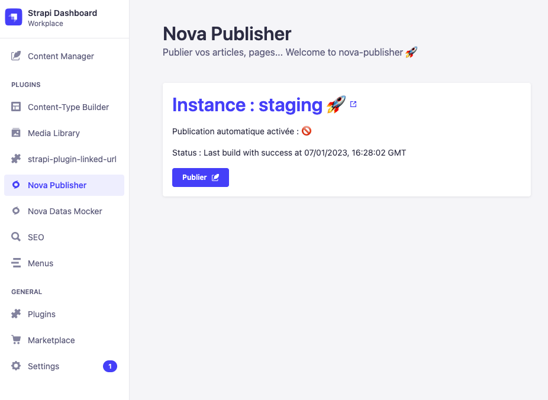

# Strapi plugin Nova Publisher

> aka Nova Publisher

A quick description of nova-publisher made by [NovaGaïa](https://novagaia.fr/).

Ce plugin fait plusieurs choses :

1. Publication flexible, une URL, en POST ou GET, avec ou sans headers ;
2. Permet de publier sur plusieurs instances (Prod, Preview, etc.) ;
3. Ajoute un composant de publication pour surcharger la gestion des états de Strapi, utile avec le CRON notamment (pas d'obligation d'utilisation) ;
4. Active un cron qui mettra à jour les instances actives et nécessitant un rebuild chaque jour à 1h du matin (pas d'obligation d'utilisation).

## 1. Gestion de la publication

### a. Configuration

La configuration se fait dans les variables d'environnement et dans la configuration du plugin.

> Ici il y a deux instances de configurées, mais vous pouvez en ajouter d'autres ou n'en mettre qu'une seule.

```js
// ./config/plugins.js
// if change, run `npm run build --clean`

module.exports = ({ env }) => ({
  // ...
  'nova-publisher': {
    enabled: true,
    config: {
      dateConfiguration: {
        dateLocaleString: 'fr-FR', // sample
        options: {
          // sample
          timeZone: 'Europe/Paris',
          timeZoneName: 'short',
          hour12: false,
        },
      },
      addPublishComponent: false,
      instances: [
        {
          name: env('INSTANCE_0_NAME'),
          icon: '🚀', // sample
          enabled: env('INSTANCE_0_ENABLED'),
          cron: env('INSTANCE_0_USE_CRON'),
          url: env('INSTANCE_0_URL'),
          method: 'post',
          headers: {
            // sample
            Authorization: `Beaver ${env('INSTANCE_0_BEAVER')}`,
          },
        },
        {
          name: env('INSTANCE_1_NAME'),
          icon: '👁️', // sample
          enabled: env('INSTANCE_1_ENABLED'),
          cron: env('INSTANCE_1_USE_CRON'),
          url: env('INSTANCE_1_URL'),
          method: 'post',
          headers: {
            // sample
            Authorization: `Beaver ${env('INSTANCE_1_BEAVER')}`,
          },
        },
      ],
    },
  },
  // ...
});
```

| Variable                             | Explain                                                               | Type    | Default value                                                         |
| ------------------------------------ | --------------------------------------------------------------------- | ------- | --------------------------------------------------------------------- |
| `dateConfiguration`                  | Configuration du format de la date dans les messages, see (1).        | Object  | (See below)                                                           |
| `dateConfiguration.dateLocaleString` | Locale à utiliser, see (1)                                            | String  | `en-EN`                                                               |
| `dateConfiguration.options`          | Options du formatage de date, see (1)                                 | String  | `{ timeZone: 'Europe/London', timeZoneName: 'short', hour12: false }` |
| `addPublishComponent`                | Ajoute le composant helper pour gérer plus finement les publications. | Boolean | `false`                                                               |
| `instances`                          | Configuration des instances où lancer la publication.                 | Object  | (See below)                                                           |
| `instances.name` \*                  | Nom de l'intance.                                                     | String  | Mandatory                                                             |
| `instances.icon` \*                  | Emoji.                                                                | String  | Mandatory                                                             |
| `instances.enabled` \*               | Active ou non l'instance.                                             | Boolean | Mandatory                                                             |
| `instances.url` \*                   | Url cible.                                                            | String  | Mandatory                                                             |
| `instances.method`                   | `POST` ou `GET`.                                                      | String  | `POST`                                                                |
| `instances.headers`                  | Headers à envoyer, see (2).                                           | Object  | -                                                                     |

\* Mandatory field

> (1) Pour `dateConfiguration`, see [Date.prototype.toLocaleString()](https://developer.mozilla.org/en-US/docs/Web/JavaScript/Reference/Global_Objects/Date/toLocaleString)
>
> (2) pour `instances.headers`, see [HTTP headers](https://developer.mozilla.org/en-US/docs/Web/HTTP/Headers)

### b. Utilisation

> **Warning**
> Avant toute utilisation, l'`Etat de publication` affiche un message générique.

> **Note**
> Le message d'`Etat de publication` n'est pas stocké en base (au cas où celle-ci serait recopiée sur d'autres instances), mais dans un fichier sous `./public/status-${instances[id].name}.txt`

Si plusieurs instances sont configurées, le bloc se répète.

`Publication automatique activée` indique si le CRON est activé pour cette instance, see `instances.enabled`.

Cliquez sur `Publier` pour déclancher l'action.

Lors du retour de l'action, l'`Etat de publication` sera mis à jour avec un message de réussite ou d'erreur et l'heure. En cas d'erreur, un `Toast` s'affiche avec l'erreur, que vous pourrez retrouver dans les logs du serveur.


